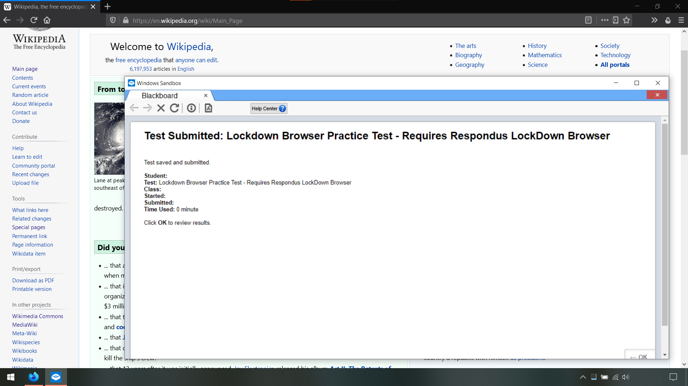

<!-- Lockdown Browser in Windows Sandbox
     https://github.com/gucci-on-fleek/lockdown-browser
     SPDX-License-Identifier: MPL-2.0+ OR CC-BY-SA-4.0+
     SPDX-FileCopyrightText: 2021 gucci-on-fleek
-->
# _Lockdown Browser_ in _Windows Sandbox_

View Demo Video

<video src="https://user-images.githubusercontent.com/49086429/143725579-42cd9f47-4462-4a54-aa8a-8419bfdebb68.mp4" title="Demonstration video of the software."></video> <!-- Licence for Example_2.webm: MPL-2.0+ OR CC-BY-SA-4.0+ -->

## What is this?
This repo allows you to run the [_Respondus Lockdown Browser_](https://web.respondus.com/he/lockdownbrowser/) in an isolated sandbox, thus completely bypassing its “security measures”. Normally, the _Lockdown Browser_ blocks you from running it if it detects that it is being virtualized. However, this tool bypasses the detection, allowing us to virtualize it.

## Why the _Lockdown Browser_ is bad
First, I am uncomfortable with installing random software on my computer. As I rule, I will only install software that is Open Source or that is from a trusted publisher. This is neither, so I am naturally a little uncomfortable installing it.

Second, the _Lockdown Browser_ is essentially indistinguishable from malware. Read this following list of documented behaviors, and see how similar these behaviors are to actual malware.
  - They recommend [disabling your antivirus software](https://archive.md/rj0Z7#73%).
  - The only way to exit it is to [physically power off your computer](https://archive.md/cp1L3#34%).
  - It [disables the Task Manager](https://archive.md/HgFeS#33%).
  - It [tracks all open software](https://archive.md/4OFCQ#33%).

And of course, there are the privacy issues. Cheating is no doubt an issue, but school-mandated surveillance software is a step too far. As far as I am concerned, this is the most significant issue. I strongly recommend reading these following links from the EFF, a non-profit who focuses on defending digital privacy.
  - _[Proctoring Apps Subject Students to Unnecessary Surveillance](https://www.eff.org/deeplinks/2020/08/proctoring-apps-subject-students-unnecessary-surveillance)_
  - _[Students Are Pushing Back Against Proctoring Surveillance Apps](https://www.eff.org/deeplinks/2020/09/students-are-pushing-back-against-proctoring-surveillance-apps)_
  - _[Senate Letter to Proctoring Companies](https://www.eff.org/document/senate-letter-proctoring-companies-12-3-2020)_

## Purpose
This tool is **not designed to facilitate cheating**. Instead, I built it for two purposes:

First, it is designed to show school administrators that the _Lockdown Browser_ is entirely ineffective. Respondus claims that it is the [“gold standard”](https://web.respondus.com/he/lockdownbrowser/) and that it cannot be bypassed, but that is clearly false. I, a random University student, managed to bypass the _Lockdown Browser_ in **a single day**. This removes all of the (supposed) benefits of the _Lockdown Browser_, and thus makes [the issues](#Why-the-Lockdown-Browser-is-bad) look even worse.

Second, it is designed to prevent students from having to install invasive spyware on their personal computers. Sometimes, administrators won't listen and will still force the _Lockdown Browser_ on their students. This tool allows you to run the _Lockdown Browser_ in an isolated sandbox, thus prevent the _Lockdown Browser_ from modifying or spying on the rest of your computer. This tool is designed for to run in the _Windows Sandbox_, but users should be able to easily adapt it to run in other Virtual Machine software. This is especially valuable for the Linux users since the _Lockdown Browser_ does not run on Linux and otherwise refuses to run in a VM.

## Disclaimer
This repository does not contain any materials belonging to Respondus Inc. You must supply your legally-acquired _Lockdown Browser_ `.exe` yourself. Any supporting and auxiliary files were either created by myself or gathered from various OSS projects with proper attribution. This project is not endorsed by Respondus Inc., nor by anyone except for myself.

Also, Respondus has explicitly granted permission for this type of research. [From their website](https://archive.md/WTat2#54%):
  > Hacker Tested, Market Approved – Hundreds of universities and schools around the world use LockDown Browser. It seems that at least one person (or team) at each institution makes it a quest to “break out” or beat the system. Some of the best minds have taken our software to task over the years, and we’ve addressed each issue that’s been raised. (Yes, **you have our blessing… go ahead and see if you can break it.**)

## System Requirements
  - Windows 10 **Pro** or **Enterprise**
  - [Visual Studio C++ Tools](https://visualstudio.microsoft.com/thank-you-downloading-visual-studio/?sku=BuildTools)
  - [git](https://git-scm.com/download/win)

## Building
Clone the repository, then run `build.ps1`. Then, [install the _Windows Sandbox_](https://www.howtogeek.com/399290/how-to-use-windows-10s-new-sandbox-to-safely-test-apps/). That's it!

## Running
1. Build the project as shown above.
2. Download the _Respondus Lockdown Browser_ and place it in `runtime_directory\`.
3. Double-click `Sandbox.wsb` (it’s in `runtime_directory\`)
4. Wait. It’ll take about a minute, but eventually the _Lockdown Browser_ will open, completely automatically.

## Technical Details (How does it work?)

This repo consists of a few fairly simple tools cobbled together into a coherent package. 

The _Lockdown Browser_ detects a few BIOS-related registry keys in `HKLM:\HARDWARE\DESCRIPTION`. Therefore, `sandbox_run.ps1` deletes these keys/values.

The _Lockdown Browser_ calls `GetSystemMetrics(SM_REMOTESESSION)` to determine if it is running in and RDP session. Since this function is in `user32.dll`, there aren’t any trivial ways to fix this. However, [_Microsoft Detours_](https://github.com/microsoft/Detours) allows for you to intercept and replace any function in any `.dll`. A small hook (`GetSystemMetrics-Hook.cpp`) is used with `Detours` to intercept the function call and return a false value.

Because this tool runs in the _Windows Sandbox_, no state is retained between sessions. Therefore, this tool provides a scripted installer for the _Lockdown Browser_. The _Lockdown Browser_’s installer is a little tricky to script, so the installation is a little hacky, but it works. And again, the _Sandbox_ is completely isolated from the rest of your system, so the _Lockdown Browser_ cannot cause any harm to your computer.
