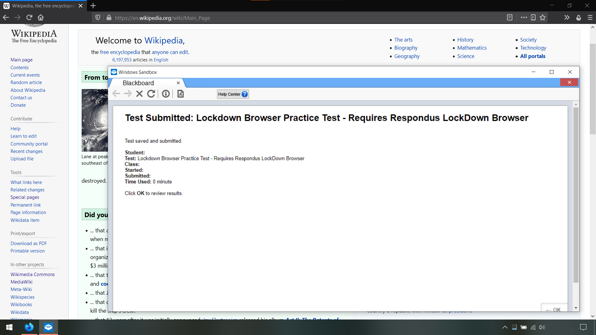
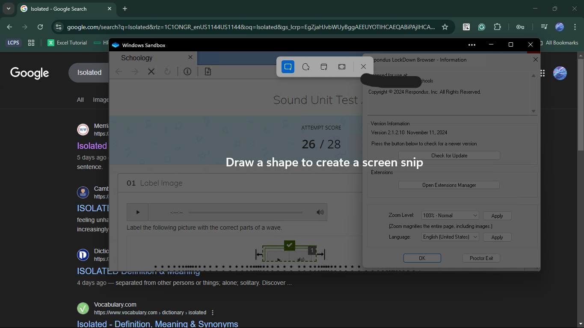
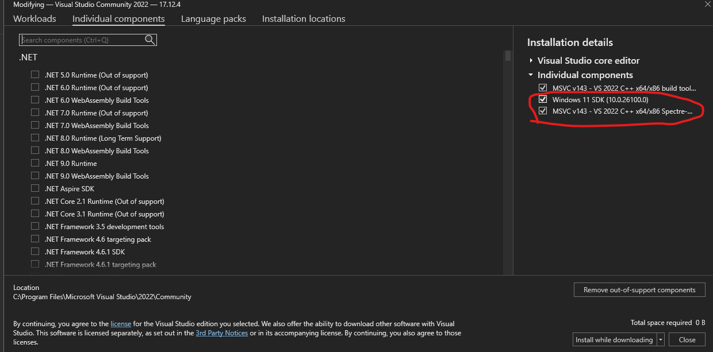

<!-- Lockdown Browser in Windows Sandbox
     https://github.com/gucci-on-fleek/lockdown-browser
     SPDX-License-Identifier: MPL-2.0+ OR CC-BY-SA-4.0+
     SPDX-FileCopyrightText: 2020-2025 gucci-on-fleek and Voidless7125
-->
# _Lockdown Browser_ in _Windows Sandbox_


<details><summary>View Demo Video</summary>
<video src="https://user-images.githubusercontent.com/49086429/143725579-42cd9f47-4462-4a54-aa8a-8419bfdebb68.mp4" title="Demonstration video of the software."></video> <!-- Licence for Example_2.webm: MPL-2.0+ OR CC-BY-SA-4.0+ --></details>

## What is this?

This repo allows you to run the [_Respondus Lockdown Browser_](https://web.respondus.com/he/lockdownbrowser/) in an isolated sandbox, completely bypassing its “security measures.” Usually, the Lockdown Browser blocks you from running it if it detects that it is being virtualized. However, this tool bypasses the detection, allowing us to virtualize it.

## Why the _Lockdown Browser_ is bad

First, I am uncomfortable installing random software on my computer. I only install software that is open source or from a trusted publisher, and this software is neither.

Second, the _Lockdown Browser_ is essentially indistinguishable from malware. Read the following list of documented behaviors and see how similar these behaviors are to actual malware.

- They recommend [disabling your antivirus software](https://archive.md/rj0Z7#73%).
- The only way to exit it is to [physically power off your computer](https://archive.md/cp1L3#34%).
- It [disables the Task Manager](https://archive.md/HgFeS#33%).
- It [tracks all open software](https://archive.md/4OFCQ#33%).

And, of course, there are privacy issues. Cheating is no doubt an issue, but school-mandated surveillance software is a step too far. This is the most significant issue. I strongly recommend reading the following links from the EFF, a non-profit that focuses on defending digital privacy.

- _[Proctoring Apps Subject Students to Unnecessary Surveillance](https://www.eff.org/deeplinks/2020/08/proctoring-apps-subject-students-unnecessary-surveillance)_
- _[Students Are Pushing Back Against Proctoring Surveillance Apps](https://www.eff.org/deeplinks/2020/09/students-are-pushing-back-against-proctoring-surveillance-apps)_
- _[Senate Letter to Proctoring Companies](https://www.eff.org/document/senate-letter-proctoring-companies-12-3-2020)_

## Purpose

This tool is **not designed to facilitate cheating**. Instead, I built it for three purposes:

First, it is designed to show school administrators that the _Lockdown Browser_ is entirely ineffective. Respondus claims that it is the [“gold standard”](https://web.respondus.com/he/lockdownbrowser/) and that it cannot be bypassed, but that is false. I, a random University student, bypassed the _Lockdown Browser_ in **a single day**. This removes all of the (supposed) benefits of the _Lockdown Browser_, and thus makes [the issues](#why-the-lockdown-browser-is-bad) look even worse.

Second, it is designed to prevent students from having to install invasive spyware on their personal computers. Sometimes, administrators won't listen and will still force the _Lockdown Browser_ on their students. This tool allows you to run the _Lockdown Browser_ in an isolated sandbox, thus preventing the _Lockdown Browser_ from modifying or spying on the rest of your computer. This tool is designed to run in the _Windows Sandbox_, but users should be able to adapt it to run in other Virtual Machine software quickly. This is especially valuable for Linux users since the _Lockdown Browser_ does not run on Linux and otherwise refuses to run in a VM.

Finally, this tool allows you to take screenshots of the _Lockdown Browser_. Typically, the _Lockdown Browser_ prevents you from taking screenshots of its window; however, this tool bypasses that restriction by running it inside the _Windows Sandbox_. Taking screenshots can provide accountability since otherwise, nothing guarantees that no one changed your answers after you submitted your test.

## Disclaimer

This repository does not contain any materials belonging to Respondus Inc. You must supply your legally-acquired _Lockdown Browser_ `.exe` yourself. Any supporting and auxiliary files were either created by myself or gathered from various OSS projects with proper attribution. This project is not endorsed by Respondus Inc. or anyone except myself.

This project is intended merely as a proof-of-concept. While this tool could be used to facilitate cheating, this is not my intent. Any consequences of using this tool in a real exam are entirely your responsibility.

Also, I'd like to point out that Respondus has explicitly granted permission for this type of research. [From their website](https://archive.md/WTat2#54%):
  > Hacker Tested, Market Approved – Hundreds of universities and schools around the world use LockDown Browser. It seems that at least one person (or team) at each institution makes it a quest to “break out” or beat the system. Some of the best minds have taken our software to task over the years, and we’ve addressed each issue that’s been raised. (Yes, **you have our blessing… go ahead and see if you can break it.**)

## System Requirements

- Windows 10 **Pro** or **Enterprise**

- [Visual Studio C++ Tools](https://visualstudio.microsoft.com/thank-you-downloading-visual-studio/?sku=BuildTools)

  (Make sure to include the “MSVC C++ build tools” and “Windows SDK” components.)
  
  
  
- [git](https://git-scm.com/download/win)

## Building

Make sure to **clone** the repository and run `build.ps1`. Then, [install the _Windows Sandbox_](https://www.howtogeek.com/399290/how-to-use-windows-10s-new-sandbox-to-safely-test-apps/). That's it!

## Running

1. Build the project as shown above.
2. Download the _Respondus Lockdown Browser_ and place it in `runtime_directory\`.
3. Double-click `Sandbox.wsb` (it’s in `runtime_directory\`)

   (_Alternative_) If you want to pass your microphone and camera to the _Lockdown Browser_, run `Sandbox-with-Microphone-Camera.wsb` instead.
4. Go to your test and open it. The _Lockdown Browser_ will launch, and you can then use it to complete your test.

## Common Issues

### The _Browser_ updates itself, then it stops working

This tool does not support having the _Lockdown Browser_ update itself. Instead, whenever an update is available for the browser, you should download a fresh installer from wherever you originally downloaded it. The URL should be similar in format to:

```text
https://download.respondus.com/lockdown/download7.php?id=XXXXXXXXX
```

### You get a “Terminal Services” error message

If the _Lockdown Browser_ fails to launch, you can open the shortcut on the VM's desktop. If you are on a older version, you'll need to instead open a PowerShell prompt inside the VM and run:

```powershell
cd C:\Users\WDAGUtilityAccount\Desktop\runtime_directory\
.\withdll.exe /d:GetSystemMetrics-Hook.dll "C:\Program Files (x86)\Respondus\LockDown Browser\LockDownBrowser.exe"
```
(OEM versions of the _Lockdown Browser_ must have a URI at the end; `ldb:dh%7BKS6poDqwsi1SHVGEJ+KMYaelPZ56lqcNzohRRiV1bzFj3Hjq8lehqEug88UjowG1mK1Q8h2Rg6j8kFZQX0FdyA==%7D` is a good default)


```powershell
cd C:\Users\WDAGUtilityAccount\Desktop\runtime_directory\
.\withdll.exe /d:GetSystemMetrics-Hook.dll "C:\Program Files (x86)\Respondus\LockDown Browser\LockDownBrowser.exe"
```

Of course, this is usually symptomatic of another issue, so please make sure you have followed all the earlier instructions.

### Other issues

If you have made sure that you have followed all the instructions, please feel free to [open a new issue](https://github.com/gucci-on-fleek/lockdown-browser/issues/new/choose). Ensure you include any error messages and your _Lockdown Browser_ version.

## Technical Details (How does it work?)

This repo consists of simple tools cobbled together into a coherent package.

The _Lockdown Browser_ detects a few BIOS-related registry keys in `HKLM:\HARDWARE\DESCRIPTION`. Therefore, `sandbox_run.ps1` deletes these keys/values.

When the _Lockdown Browser_ detects that `VmComputeAgent.exe` is running, it realizes it is in a VM and refuses to launch. This program is part of the _Windows Sandbox_, and cannot be stopped without crashing the VM.  However, when the _Browser_ checks all the running programs, it also opens and examines each image file. If `sandbox_run.ps1` deletes the image file, the _Lockdown Browser_ acts as if the program isn't even running.

The _Lockdown Browser_ calls `GetSystemMetrics(SM_REMOTESESSION)` to determine if it runs in an RDP session. Since this function is in `user32.dll`, there aren’t any trivial ways to fix this. However, [_Microsoft Detours_](https://github.com/microsoft/Detours) allows you to intercept and replace any function in any `.dll`. A small hook (`GetSystemMetrics-Hook.cpp`) is used with `Detours` to intercept the function call and return a false value.

Because this tool runs in the _Windows Sandbox_, no state is retained between sessions. Therefore, this tool provides a scripted installer for the _Lockdown Browser_. The _Lockdown Browser_’s installer is a little tricky to script, so the installation is a little hacky, but it works. And again, the _Sandbox_ is completely isolated from the rest of your system, so the _Lockdown Browser_ cannot cause any harm to your computer.

## License

All code is licensed under the [_Mozilla Public License_, version 2.0](https://www.mozilla.org/en-US/MPL/2.0/) or greater. The documentation is licensed under [CC-BY-SA, version 4.0](https://creativecommons.org/licenses/by-sa/4.0/legalcode) or greater, in addition to the MPL. The _Detours_ submodule has an MIT licence as detailed in `Detours/LICENSE.md`.

In addition to the formal licence terms, I would appreciate it if users do not distribute any binaries: I intend for this project to be merely a proof-of-concept, and any binaries circulating on the internet diminish this status. Of course, you are well within your rights to ignore this request, but I would appreciate it if you respect my wishes. Thanks!
